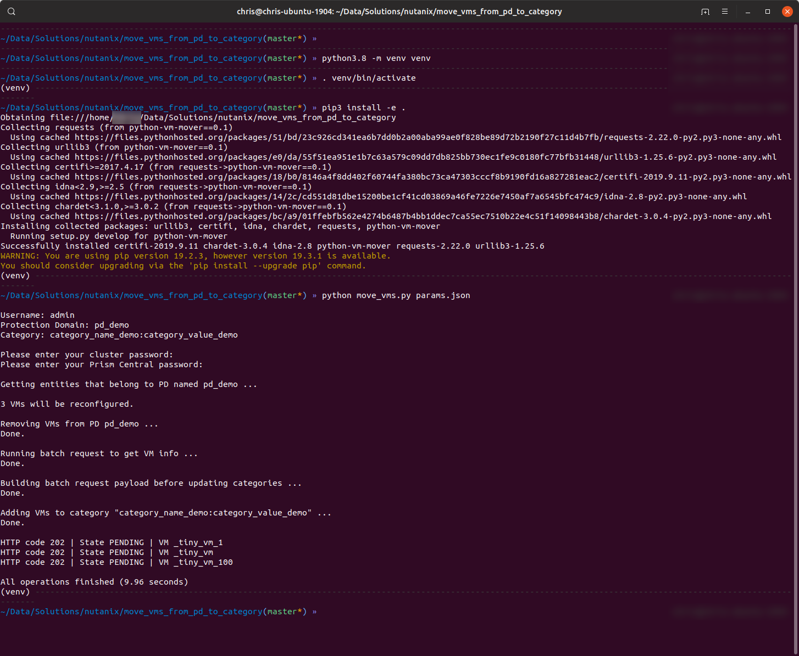

==========================================
Move VM from Protection Domain to Category
==========================================

- Use included params.json as API request parameters
- List all VMs that are entities within an existing Protection Domain
- Remove those VMs from an existing Protection Domain
- Assign the same VMs to an existing category

---------------
Important Notes
---------------

- This script has been written for demo purposes only.  *Please* make sure to add appropriate error-checking and exception handling before using it in production.
- For use in production it would advisable to add checks for making the PD and Category exist.

------------
Requirements
------------

- Python >=3.6 (lower versions will NOT work)
- pip3 (for dependencies installation)
- Tested on Python 3.6, 3.7 and 3.8

-----
Usage
-----

- Clone repo to your local machine
- Setup a virtual environment on Linux or Mac (strongly recommended):

   .. code-block:: python

      python3.8 -m venv venv
      . venv/bin/activate

- Setup a virtual environment on Windows (strongly recommended):

   .. note:: See https://docs.python.org/3/library/venv.html for Windows instructions

- Install the dependencies:

   .. code-block:: python

      pip3 install -e .

- Adjust values in **params.json** to match your Prism Element, Prism Central, Protection Domain and category settings
- Run the script:

   .. code-block:: python

      python3.8 move_vms.py params.json

----------
Screenshot
----------

An example of the script running is shown below.

